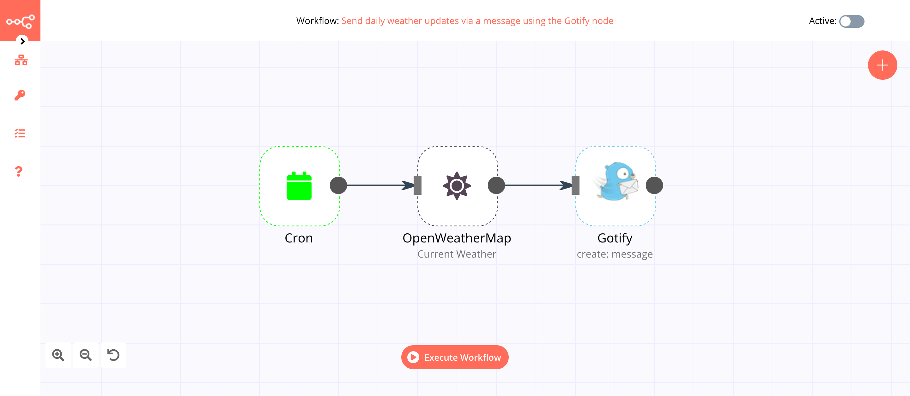
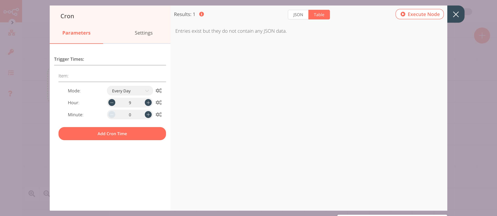
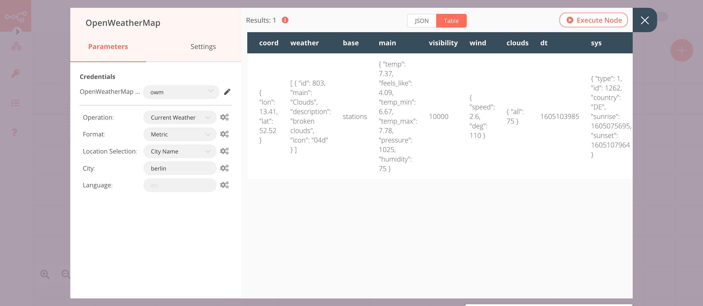
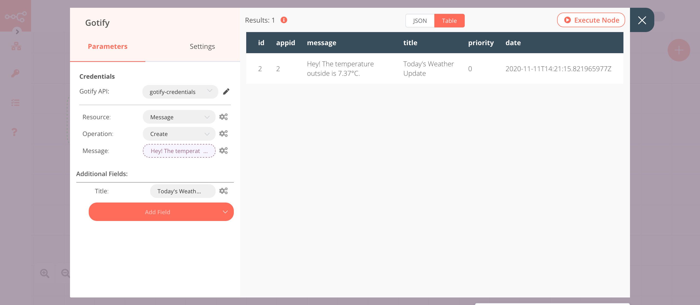

# Gotify

[Gotify](https://gotify.net/) is a server for sending and receiving messages.

::: tip 🔑 Credentials
You can find authentication information for this node [here](../../../credentials/Gotify/README.md).
:::

## Basic Operations

::: details Message
- Create
- Delete
- Get All
:::

## Example Usage

This workflow allows you to send daily weather updates via a message using the Gotify node. You can also find the [workflow](https://n8n.io/workflows/774) on n8n.io. This example usage workflow uses the following nodes.
- [Cron](../../core-nodes/Cron/README.md)
- [OpenWeatherMap](../../nodes/OpenWeatherMap/README.md)
- [Gotify]()

The final workflow should look like the following image.

### 1. Cron node

The Cron node will trigger the workflow daily at 9 AM.

1. Click on ***Add Cron Time***.
2. Set hours to 9 in the ***Hour*** field.
3. Click on ***Execute Node*** to run the node.

In the screenshot below, you will notice that the Cron node is configured to trigger the workflow every day at 9 AM.

### 2. OpenWeatherMap node (Current Weather)

This node will return data about the current weather in Berlin. To get the weather updates for your city, you can enter the name of your city instead.

1. First of all, you'll have to enter credentials for the OpenWeatherMap node. You can find out how to do that [here](../../../credentials/OpenWeatherMap/README.md).
2. Enter `berlin` in the ***City*** field.
3. Click on ***Execute Node*** to run the node.

In the screenshot below, you will notice that the node returns data about the current weather in Berlin.

### 3. Gotify node (create: message)

This node will send a message with the weather update.

1. First of all, you'll have to enter credentials for the Gotify node. You can find out how to do that [here](../../../credentials/Gotify/README.md).
2. Click on the gears icon next to the ***Message*** field and click on ***Add Expression***.
::: v-pre
3. Enter the following message in the ***Expression*** field: `Hey! The temperature outside is {{$node["OpenWeatherMap"].json["main"]["temp"]}}°C.`.
4. Click on ***Add Field*** and select 'Title' from the dropdown list.
5. Enter `Today's Weather Update` in the ***Title*** field.
6. Click on ***Execute Node*** to run the node.
:::

In the screenshot below, you will notice that the node sends a message with the weather update.

::: tip 💡 Activate workflow for production
This example workflow uses the Cron node, which is a Trigger node. You'll need to save the workflow and then click on the Activate toggle on the top right of the screen to activate the workflow. Your workflow will then be triggered as specified by the settings in the Cron node.
:::
