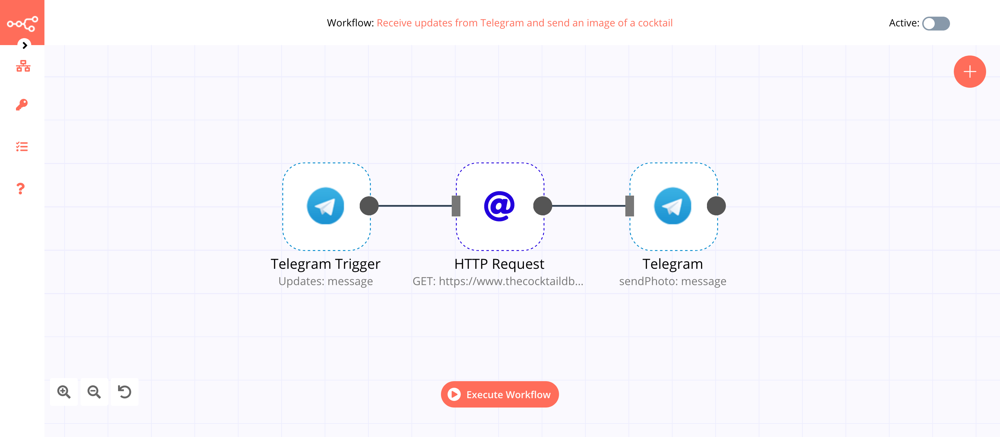
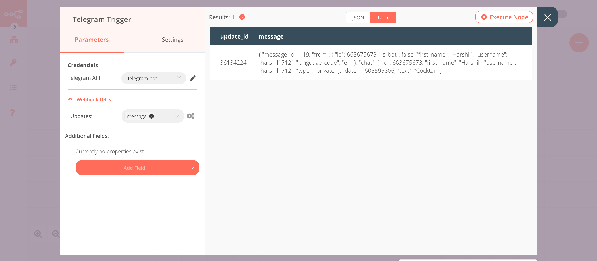
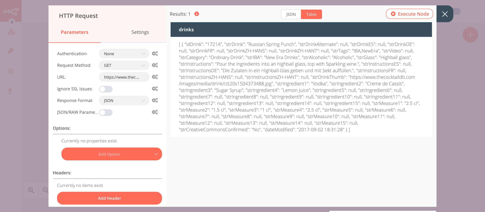
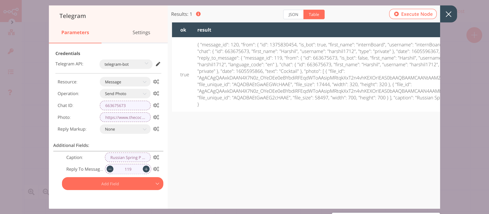

# Telegram Trigger

[Telegram](https://telegram.org/) is a cloud-based instant messaging and voice over IP service. Users can send messages and exchange photos, videos, stickers, audio, and files of any type.

::: tip 🔑 Credentials
You can find authentication information for this node [here](../../../credentials/Telegram/README.md).
:::

## Updates

- `*`: All updates
- ***message***: Trigger on a new incoming message of any kind- text, photo, sticker, etc
- ***edited_message***: Trigger on a new version of a channel post that is known to the bot and was edited
- ***channel_post***: Trigger on a new incoming channel post of any kind - text, photo, sticker, etc
- ***edited_channel_post***: Trigger on a new version of a channel post that is known to the bot and was edited
- ***inline_query***: Trigger on a new incoming inline query
- ***callback_query***: Trigger on a new incoming callback query
- ***shipping_query***: Trigger on a new incoming shipping query. Only for invoices with flexible price
- ***pre_checkout_query***: Trigger on a new incoming pre-checkout query. Contains full information about checkout
- ***poll***: Trigger on a new poll state. Bots receive only updates about stopped polls and polls which are sent by the bot

## Example Usage

This workflow allows you to receive messages using the Telegram Trigger node and send an image of a cocktail when a message is received. You can also find the [workflow](https://n8n.io/workflows/782) on n8n.io. This example usage workflow would use the following nodes.
- [Telegram Trigger]()
- [HTTP Request](../../core-nodes/HTTPRequest/README.md)
- [Telegram](../../nodes/Telegram/README.md)

The final workflow should look like the following image.

### 1. Telegram Trigger node

This node will trigger the workflow when a user sends a new message.

1. First of all, you'll have to enter credentials for the Telegram Trigger node. You can find out how to do that [here](../../../credentials/Telegram/README.md).
2. Select 'message' from the ***Updates*** dropdown list. This will trigger the workflow when a user sends a message.
3. Click on ***Execute Node*** to run the node.

In the screenshot below, you will notice that the node triggers the workflow when a user sends a new message.

### 2. HTTP Request node (GET)

This node will make a GET request to the API `https://www.thecocktaildb.com/api/json/v1/1/random.php` to fetch a random cocktail. This information gets passed on to the next node in the workflow.

1. Enter `https://www.thecocktaildb.com/api/json/v1/1/random.php` in the ***URL*** field.
2. Click on ***Execute Node*** to run the node.

In the screenshot below, you will notice that the node makes a GET request to the API and returns information about a random cocktail.

### 3. Telegram node (sendPhoto: message)

This node will send a reply to the message with the name and image of the cocktail that we got from the previous node.
::: v-pre
1. Select the credentials that you entered in the Telegram Trigger node.
2. Select 'Send Photo' from the ***Operation*** dropdown list.
3. Click on the gears icon next to the ***Chat ID*** field and click on ***Add Expression***.
4. Select the following in the ***Variable Selector*** section: Nodes > Telegram Trigger > Output Data > JSON > message > chat > id. You can also add the following expression: `{{$node["Telegram Trigger"].json["message"]["chat"]["id"]}}`.
5. Click on the gears icon next to the ***Photo*** field and click on ***Add Expression***.
6. Select the following in the ***Variable Selector*** section: Nodes > HTTP Request > Output Data > JSON > drinks > [item: 0] > strDrinkThumb. You can also add the following expression: `{{$node["HTTP Request"].json["drinks"][0]["strDrinkThumb"]}}`.
7. Click on ***Add Field*** and select 'Caption' from the dropdown list.
8. Click on the gears icon next to the ***Caption*** field and click on ***Add Expression***.
9. Select the following in the ***Variable Selector*** section: Nodes > HTTP Request > Output Data > JSON > drinks > [item: 0] > strDrink. You can also add the following expression: `{{$node["HTTP Request"].json["drinks"][0]["strDrink"]}}`.
10. Click on ***Add Field*** and select 'Reply To Message ID' from the dropdown list.
11. Click on the gears icon next to the ***Reply To Message ID*** field and click on ***Add Expression***.
12. Select the following in the ***Variable Selector*** section: Nodes > Telegram Trigger > Output Data > JSON > message > message_id. You can also add the following expression: `{{$node["Telegram Trigger"].json["message"]["message_id"]}}`.
13. Click on ***Execute Node*** to run the node.
:::
In the screenshot below, you will notice that the node sends a reply to the message with the name and image of the cocktail that we got from the previous node.

::: tip 💡 Activate workflow for production
You'll need to save the workflow and then click on the Activate toggle on the top right of the screen to activate the workflow. Your workflow will then be triggered as specified by the settings in the Telegram Trigger node.
:::

## Further Reading

- [Automatically Adding Expense Receipts to Google Sheets with Telegram, Mindee, Twilio, and n8n 🧾](https://medium.com/n8n-io/automatically-adding-expense-receipts-to-google-sheets-with-telegram-mindee-twilio-and-n8n-c47eb2f8d7a5)
- [Creating Telegram Bots with n8n, a No-Code Platform](https://medium.com/n8n-io/creating-telegram-bots-with-n8n-a-no-code-platform-fdf1f0928da7)
